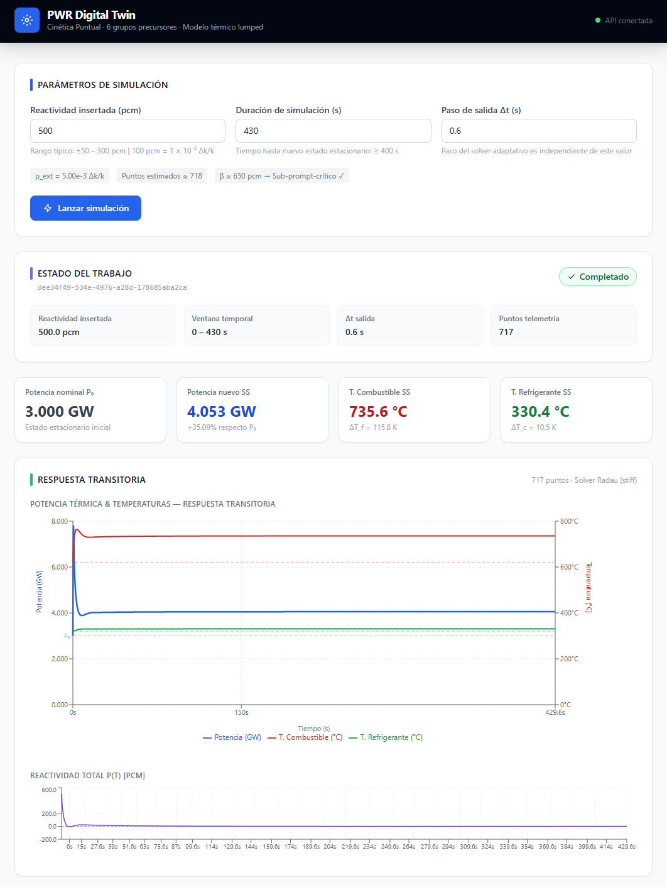

# PWR Digital Twin — Multiphysics Reactor Simulator

A prototype digital twin of a Pressurized Water Reactor (PWR) that couples
Point Kinetics Equations (PKE) with a lumped thermal-hydraulic model to
simulate neutron population transients driven by external reactivity
insertions.  The system provides a REST API for submitting simulation jobs,
a Celery worker that solves the stiff ODE system asynchronously, a
TimescaleDB time-series store for telemetry, and a React dashboard for
real-time visualization.

---
## Author

**Leandro Igor Estrada Santos,**
A Software Engineering student and nuclear energy enthusiast.

---


## Physics Model

The neutron dynamics follow the **6-group Keepin PKE** for U-235 in a thermal
spectrum, coupled to a **two-node lumped thermal-hydraulic** model with linear
Doppler and moderator temperature feedback.

```
Neutronics
  dn/dt   = [(ρ(t) − β) / Λ] · n(t) + Σᵢ λᵢ · Cᵢ(t)
  dCᵢ/dt  = (βᵢ / Λ) · n(t) − λᵢ · Cᵢ(t)         (i = 1 … 6)

Reactivity (linear feedback)
  ρ(t) = ρ_ext + α_f · (T_f − T_f₀) + α_c · (T_c − T_c₀)

Thermal-hydraulics (two-node lumped)
  γ_f · dT_f/dt = n·P₀ − UA_fc · (T_f − T_c)
  γ_c · dT_c/dt = UA_fc · (T_f − T_c) − G_cool · (T_c − T_in)
```

| Parameter | Value | Description |
|-----------|------:|-------------|
| P₀ | 3 000 MW | Rated thermal power |
| Λ | 20 µs | Prompt-neutron generation time |
| β_total | 650.2 pcm | Σ βᵢ (Keepin U-235, thermal spectrum) |
| α_f | −2.5×10⁻⁵ Δk/k per K | Doppler coefficient |
| α_c | −2.0×10⁻⁴ Δk/k per K | Moderator temperature coefficient |
| UA_fc | 10⁷ W/K | Fuel-to-coolant conductance |
| G_cool | 10⁸ W/K | Coolant capacity flow rate |

Numerical solver: `scipy.integrate.solve_ivp` with `method='Radau'`
(L-stable, 5th-order implicit Runge-Kutta), tolerances rtol = atol = 10⁻⁸.
Stiffness ratio of the system: ~3×10⁶.

Full model documentation, parameter provenance, and explicit limitations are
in [`docs/model_assumptions.md`](docs/model_assumptions.md).

---

## Architecture

```
┌─────────────────────────────────────────────────────┐
│                   Browser  :3000                    │
│         React + Vite + TailwindCSS + recharts       │
└───────────────────────┬─────────────────────────────┘
                        │ /api/*  (Nginx proxy)
┌───────────────────────▼─────────────────────────────┐
│               FastAPI  :8000                        │
│   POST /runs/   GET /runs/{id}/status   /telemetry  │
└───────────┬─────────────────────────┬───────────────┘
            │ Celery task             │ SQLAlchemy
            ▼                         ▼
┌───────────────────┐    ┌──────────────────────────────┐
│   Celery Worker   │    │   TimescaleDB (pg15)  :5432  │
│  ScipySolver      │───▶│  runs + telemetry           │
│  (Radau stiff ODE)│    │   (hypertable, 1-day chunks) │
└───────────────────┘    └──────────────────────────────┘
            │
 Redis :6379 (broker + result backend)
```

Services are orchestrated with Docker Compose.  The API and Worker images are
built from the same `backend/Dockerfile` (multi-stage, non-root `appuser`);
only the `CMD` differs.  The frontend is served by Nginx in a separate
multi-stage image.

---

## Stack

| Layer | Technology |
|-------|-----------|
| Physics solver | Python 3.12, NumPy 2, SciPy 1.14 (Radau) |
| API | FastAPI 0.115, Uvicorn, Pydantic v2 |
| Task queue | Celery 5.4, Redis 7 |
| ORM / migrations | SQLAlchemy 2.0, Alembic |
| Database | TimescaleDB (PostgreSQL 15) |
| Package management | uv |
| Frontend | React 18, TypeScript, Vite, TailwindCSS, recharts |
| Container runtime | Docker Compose (CPU), Docker Compose + ROCm (GPU) |
| Code quality | ruff, mypy (strict), pytest |

---

## Repository Layout

```
multiphysics-pwr-twin/
├── backend/
│   ├── app/
│   │   ├── api/            # FastAPI routers (runs.py)
│   │   ├── core/           # Config (Pydantic-settings), DB session
│   │   ├── models/         # SQLAlchemy ORM (Run, Telemetry)
│   │   ├── physics/
│   │   │   ├── constants.py     # 6-group Keepin data + nominal PWR params
│   │   │   ├── base.py          # ReactorParams, SimulationResult, ABC
│   │   │   ├── scipy_solver.py  # ScipySolver — adaptive Radau
│   │   │   └── tensor_solver.py # TensorSolver — vectorized batch RK4
│   │   ├── schemas/        # Pydantic request/response models
│   │   └── worker/         # Celery app + simulation task
│   ├── alembic/            # DB migrations (hypertable setup)
│   ├── tests/              # 33 physics + integration tests
│   ├── Dockerfile          # CPU multi-stage image
│   ├── Dockerfile.gpu      # ROCm/PyTorch image (GPU worker)
│   └── pyproject.toml
├── frontend/
│   ├── src/
│   │   ├── api/            # Axios wrappers
│   │   ├── components/     # SimulationForm, TelemetryChart, StatusBadge
│   │   ├── pages/          # Dashboard.tsx
│   │   └── types/          # Shared TypeScript types
│   ├── Dockerfile          # Vite build → Nginx runtime
│   └── nginx.conf
├── docs/
│   └── model_assumptions.md  # Equations, parameters, limitations
├── docker-compose.yml        # CPU stack (default)
├── docker-compose.gpu.yml    # GPU override (ROCm AMD)
└── Makefile
```

---

## Getting Started

### Prerequisites

- Docker Engine ≥ 24 with Compose plugin
- (Optional) AMD GPU with ROCm 6.x for the GPU worker

### 1. Environment

```bash
cp .env   # fill in POSTGRES_USER, POSTGRES_PASSWORD, etc.
```

### 2. Build and start (CPU)

```bash
make build   # builds api, worker, frontend images
make up      # starts db, redis, migrate, api, worker, frontend
```

Services:

| Service | URL |
|---------|-----|
| Dashboard | http://localhost:3000 |
| API (OpenAPI) | http://localhost:8000/docs |
| TimescaleDB | localhost:5432 |
| Redis | localhost:6379 |

### 3. GPU worker (AMD ROCm)

```bash
# Native Linux (RDNA2/RDNA3)
docker compose -f docker-compose.yml -f docker-compose.gpu.yml up worker-gpu

# WSL2 (DXG bridge, experimental)
HSA_OVERRIDE_GFX_VERSION=11.0.0 \
docker compose -f docker-compose.yml -f docker-compose.gpu.yml up worker-gpu
```

Set `PHYSICS_BACKEND=torch` in `.env` or in `docker-compose.gpu.yml` to
activate the PyTorch/ROCm backend in `tensor_solver.py`.  The CPU stack
(NumPy) remains the default and requires no GPU.

---

## API Reference

### Submit a simulation run

```
POST /runs/
```

```json
{
  "external_reactivity": 1e-3,
  "time_span": [0, 100],
  "dt": 1.0
}
```

Returns `202 Accepted` with `{ "run_id": "<uuid>", "status": "pending" }`.

`external_reactivity` is in Δk/k (1 pcm = 1×10⁻⁵). `time_span` is `[t_start,
t_end]` in seconds (max 86 400 s). `dt` is the output time step in seconds.

### Poll run status

```
GET /runs/{run_id}/status
```

Returns `{ "status": "pending" | "running" | "completed" | "failed", ... }`.

### Retrieve telemetry

```
GET /runs/{run_id}/telemetry
```

Returns the full time series: `power_w`, `t_fuel_k`, `t_coolant_k`,
`reactivity`, `neutron_population` at each output time point.

---

## Development

All commands run against the local `.venv` managed by `uv`.

```bash
cd backend

# Install dependencies (including dev extras)
uv sync --all-extras

# Run tests
uv run pytest -v                           # 33 tests
uv run pytest -v --cov=app --cov-report=term-missing

# Lint + type-check
uv run ruff check app tests
uv run ruff format --check app tests
uv run mypy app

# Auto-fix
uv run ruff check --fix app tests
uv run ruff format app tests
```

Or via Makefile from the repo root:

```bash
make test
make lint
make format
```

---

## Solvers

Two solvers implement the `ReactorSimulator` abstract base class in
`backend/app/physics/base.py`:

**`ScipySolver`** — production solver for accurate single-run results.
Uses adaptive Radau (implicit RK5), tolerances 10⁻⁸.  Handles stiff
transients of any length without step-size tuning.

**`TensorSolver`** — batch solver for parameter sweeps and UQ.  Classical
fixed-step RK4 operating on state shape `(N, 9)` so that N independent
parameter sets advance simultaneously.  Requires `dt ≤ 0.01 s` for PKE
stability.  Backend is selectable via `PHYSICS_BACKEND`: `numpy` (default,
CPU) or `torch` (PyTorch, ROCm/CUDA).

---

## Model Scope

The model is valid for:
- Reactivity insertions up to ±200 pcm with linear feedback
- Transient durations of seconds to ~30 minutes
- Sensitivity studies of kinetics coefficients

It does **not** model: spatial neutronics, two-phase flow, xenon/samarium
poisoning, control-rod dynamics, fuel burnup, or pump transients.  See
[`docs/model_assumptions.md`](docs/model_assumptions.md) for a complete list
of assumptions and limitations.

---


*v1.3.0 — Leandro Igor Estrada Santos's prototype, It's under my property, please if you are going to copy this to make a better version or something, please give me some credits, it's not under licensing or safety-case use.*
